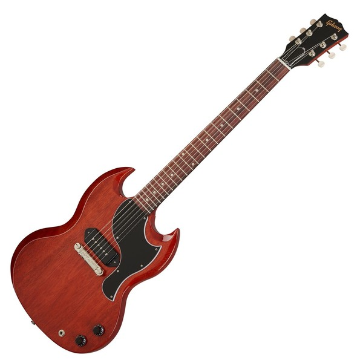
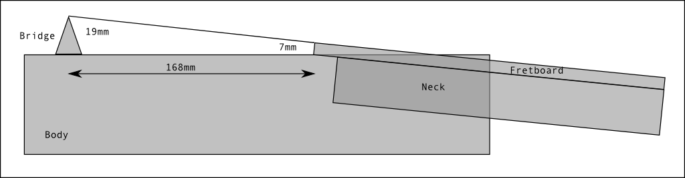

# Sanitarium

**Important notice** This is a personal web site. Any information delivered here is non-commercial.
You can use any of this content for you personal usage, not for commercial purpose.
Please contact me if you want to do so.

## How to build a guitar from "scratch"

First of all, the purpose of this article is to describe an experimentation or rather multiple experimentations around the guitar build.
I will begin to write down basic steps & goals I want to achieve:

1. To gain experience in building solid body guitars and in guitar materials and wood technics in general
2. Achieve an old dream : Be able to build a real guitar, with a real sound
3. Be able to build guitars for others (It's a rather distant goal)

### What guitar ?
I want to build a solid body guitar, which is an achievable goal in my mind.
Building a solid body guitar means :
1. Build a body with a soft piece of wood 40 cm (15") tick (the body needs to be light)
2. Build a neck with a hard piece of wood (maple wood)
3. Add the fittings and electronics parts (mics)
4. Paint the body, the neck and polish

#### How to start ?
To get started, I choose not to build the neck myself. I add not encough knowledge on this for the moment. This is a very long and difficult process that I keep for the future.
I prefer to get some knowledge and experience on the body itself which is the main part, and the simpliest part to build with basics tooling.
Next, I choosed to build a basic model of guitar : The gibson SG Junior. 

Why ? 
Because this model is quite simple to build : electronics are very basic due to the single P90 mic. 

The only tricky part of the build of this model is the presence of a workaround bridge that requires to create an angle between the neck and the body.
This problem is illustrated by the image below :

#### Get the neck
I bought a SG neck on leboncoin website. This is not an original neck from a gibson guitar.
This neck is build in maple wood.

#### Get the wood for the body
I bought 2 pieces of rectified wood on leboncoin website.
The type of wood is poplar, which is light and easy to work.
The two pieces perfectly fits together which is a very good point.
I put some wood glue on the two parts and put clamps to retain the pieces together during the sticking.
After 24 hours, I removed the clamps.

#### Stick the parts together
The tickness of a Gibson SG JR is about 35 mmm (1,3") and my piece of wood was previsouly intented to be used for a stratocaster guitar which body is about 42mm thick.
So, I used an electric planner to reduce the thickness.

The result was not perfect, and I not recommend this way of doing.

This is tghe first learning : **do not use tools that you never used before !** 
Practice beafore on a small piece of wood and check that the tool won't mess your previous work.

In my case, the wood body is now full of trenches that I need to sand with paper, that was not exactly a task I like.
Moreover, sanding a piece of wood by hand can produce unpredictible effects : curved surface, small glitches at many places in the wood.
This not ideal !

#### Carving
Now that the surface is quite flatten, I need to draw the guitar itself and move to the carving.
To make it happen, I found a draw of the Gibson SG JR on a website.
I printed it and draw the outline on a MDF board.
With my jigsaw, I cut the piece of MDF following the outline.
Know, I have a routing template for the external shape of the guitar, great !

#### Tooling
At this point, I am stucked by my lack of tooling.
I decide to buy a router on leboncoin website, for 50€ I found a bosch router.

Know that I get the perfect tool to build a guitar, I need to learn how to use it !
I find that the tool is not complete : some important parts are missing and no milling cutters are provided neither.
I find these pieces on various websites.
but in the meantime, I decide to work on the body carving with the help of the router.
(which is not the best decision I made !)

#### Back to carving with scroll saw (bad idea !!)
I have some hope to get rid of the carving with a scroll saw.
The thickness of the piece of wood is a problem : the saw is able to cut the wood despites the thickness but it is not so efficient.
One more time, the tool is not suitable for this kind of work.
The result is not very good : the cutting is not straight, I have to use a wood rasp to rectify the surface on the edges.

One more bad experience like this, and I will give up, for sure !

After a few weeks, I am back to work, I need to keep the faith, follow my dreams, and try another approach to get it done !

#### Carving is not the end of the world
After hours working with a wood rasp and sanding paper, the surface begins to be good, not perfect (we will follow *Kodawari* principles later....)

